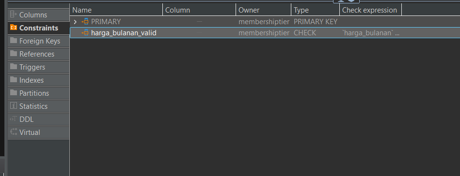

# TUBES_DATABASE

A database management system project for ITB Computer Science - Database course (Semester 4).

## Features

- Database schema management with Prisma ORM
- Automated migration system
- Custom constraint management
- SQL script generation and execution

## Prerequisites

Before you begin, ensure you have the following installed:

- [Node.js](https://nodejs.org/) (v16 or higher)
- [npm](https://www.npmjs.com/) or [yarn](https://yarnpkg.com/)
- Database system (PostgreSQL, MySQL, or SQLite)
- Git

## Installation

1. Clone the repository:

```sh
git clone <repository-url>
cd TUBES_DATABASE/backend
```

2. Install dependencies:

```sh
npm install
```

3. Setup environment variables:

```sh
cp .env.example .env
```

Edit the `.env` file with your database connection details.

## Database Setup

### Initial Setup

1. **Create the database first** - Make sure your database server is running and create a new database for this project.

2. Generate Prisma client:

```sh
npm run generate
```

3. Run initial migration:

```sh
npm run db:migrate
```

### Project Structure

```
TUBES_DATABASE/
├── backend/
│   ├── prisma/
│   │   ├── constraints/        # Custom constraint definitions
│   │   ├── migrations/         # Database migration files
│   │   └── schema.prisma       # Database schema
│   └── src/                    # Backend source code
├── doc/                        # Documentation and images
└── README.md
```

## How to Add Constraints

1. Navigate to constraint definitions:

```sh
cd prisma/constraints
```

2. Update the constraint files based on your requirements:

   - Edit existing constraint files
   - Add new constraint definitions as needed

3. Generate and apply migration scripts:

```sh
npm run migration:create:all
```

This command will:

- Reset the migrations
- Create a new constraints migration
- Combine all constraint files and write directly to the migration file
- Apply the migration to the database

4. Verify migration success:
   You should see confirmation that constraints are now synchronized with the database.



## Available Scripts

| Command                        | Description                                  |
| ------------------------------ | -------------------------------------------- |
| `npm run generate`             | Generate Prisma client                       |
| `npm run db:create`            | Create migration file without applying it    |
| `npm run db:push`              | Push schema to database without migrations   |
| `npm run db:seed`              | Seed database with initial data              |
| `npm run db:fake`              | Push schema and seed with fake data          |
| `npm run db:migrate`           | Apply pending migrations to database         |
| `npm run db:reset`             | Reset database and apply all migrations      |
| `npm run migration:create`     | Create a new migration file                  |
| `npm run migration:create:all` | Create migration scripts for all constraints |
| `npm test`                     | Run tests (not implemented yet)              |

## Development Workflow

1. **Schema Changes**: Modify `backend/prisma/schema.prisma`
2. **Constraint Updates**: Edit files in `backend/prisma/constraints/`
3. **Generate Migration**: Run `npm run migration:create:all`
4. **Apply Changes**: Run `npm run db:migrate`
5. **Test**: Verify changes work as expected
